# Satsat Two-Tier Encryption Architecture

## Visual Architecture Diagram

```mermaid
graph TB
    subgraph "User Device"
        PK["🔑 Personal Master Key<br/>📱 iOS Keychain + Biometrics<br/>🔐 User-specific encryption"]
        GK["🔑 Group Master Key<br/>📡 Shared via Nostr NIP-44<br/>🔐 Group-shared encryption"]
    end

    subgraph "Context-Specific Key Derivation"
        PK --> UK1["🔐 User Messages Key<br/>Context: user_messages:messageId<br/>🚫 Only user can decrypt"]
        PK --> UK2["🔐 User Private Key<br/>Context: user_private:userId<br/>🚫 Only user can decrypt"]
        PK --> UK3["🔐 User Notes Key<br/>Context: user_notes:noteId<br/>🚫 Only user can decrypt"]

        GK --> GK1["🔐 Group XPubs Key<br/>Context: group_xpub:groupId<br/>✅ All members can decrypt"]
        GK --> GK2["🔐 Group Balance Key<br/>Context: group_balances:groupId<br/>✅ All members can decrypt"]
        GK --> GK3["🔐 Group Goals Key<br/>Context: group_goals:groupId<br/>✅ All members can decrypt"]
    end

    subgraph "Encrypted Core Data Storage"
        UK1 --> ED1["💬 Encrypted User Messages<br/>❌ Database admin cannot read<br/>🔒 Personal privacy protected"]
        UK2 --> ED2["🔑 Encrypted Private Keys<br/>❌ Database admin cannot read<br/>🔒 Financial keys secure"]
        UK3 --> ED3["📝 Encrypted User Notes<br/>❌ Database admin cannot read<br/>🔒 Personal data protected"]

        GK1 --> ED4["📊 Encrypted XPubs<br/>❌ Database admin cannot read<br/>✅ Group members can decrypt<br/>💰 For balance monitoring"]
        GK2 --> ED5["💰 Encrypted Balances<br/>❌ Database admin cannot read<br/>✅ Group members can decrypt<br/>📈 For progress tracking"]
        GK3 --> ED6["🎯 Encrypted Goals<br/>❌ Database admin cannot read<br/>✅ Group members can decrypt<br/>🎯 For goal coordination"]
    end

    subgraph "Database Admin View - Only Sees Encrypted Blobs"
        ED1 --> DB1["📋 Table: EncryptedUserData<br/>userId: user456<br/>dataType: messages<br/>encryptedData: 0x8a7b9c2d..."]
        ED2 --> DB2["📋 Table: EncryptedUserData<br/>userId: user456<br/>dataType: keys<br/>encryptedData: 0x1f4e8b3a..."]
        ED3 --> DB3["📋 Table: EncryptedUserData<br/>userId: user456<br/>dataType: notes<br/>encryptedData: 0x7e1d9c4a..."]

        ED4 --> DB4["📋 Table: EncryptedGroupData<br/>groupId: group123<br/>dataType: xpubs<br/>encryptedData: 0x9d2c7f1e..."]
        ED5 --> DB5["📋 Table: EncryptedGroupData<br/>groupId: group123<br/>dataType: balances<br/>encryptedData: 0x3c8f2a1b..."]
        ED6 --> DB6["📋 Table: EncryptedGroupData<br/>groupId: group123<br/>dataType: goals<br/>encryptedData: 0x4f7a2e8b..."]
    end

    subgraph "Security Guarantees"
        SG1["🚫 Database Admin:<br/>Cannot read any sensitive data<br/>Sees only encrypted blobs"]
        SG2["👤 Individual User:<br/>Can decrypt personal messages/keys<br/>Cannot access other users' data"]
        SG3["👥 Group Members:<br/>Can decrypt financial data (xpubs/balances)<br/>Cannot access personal messages"]
        SG4["🔐 AES-256-GCM Encryption:<br/>Authenticated encryption<br/>Context-specific keys<br/>Perfect forward secrecy"]
    end

    style PK fill:#ff9999,stroke:#333,stroke-width:3px
    style GK fill:#99ccff,stroke:#333,stroke-width:3px
    style ED1 fill:#ffcccc,stroke:#333,stroke-width:2px
    style ED2 fill:#ffcccc,stroke:#333,stroke-width:2px
    style ED3 fill:#ffcccc,stroke:#333,stroke-width:2px
    style ED4 fill:#ccddff,stroke:#333,stroke-width:2px
    style ED5 fill:#ccddff,stroke:#333,stroke-width:2px
    style ED6 fill:#ccddff,stroke:#333,stroke-width:2px
    style SG1 fill:#ffffcc,stroke:#333,stroke-width:2px
    style SG2 fill:#ffffcc,stroke:#333,stroke-width:2px
    style SG3 fill:#ffffcc,stroke:#333,stroke-width:2px
    style SG4 fill:#ffffcc,stroke:#333,stroke-width:2px
```

## Architecture Summary

### 🔐 Two-Tier Encryption System

**Personal Tier (Red)**: User-specific data encrypted with personal master key

- Private messages, private keys, personal notes
- Only the individual user can decrypt
- Stored in iOS Keychain with biometric protection

**Group Tier (Blue)**: Financial data encrypted with group master key

- Extended public keys (xpubs), balances, savings goals
- All group members can decrypt for collaboration
- Shared securely via Nostr NIP-44 encryption

### 🛡️ Privacy Protection Levels

1. **Database Admin**: Sees only encrypted blobs - zero sensitive data access
2. **Individual Users**: Access personal data only - cannot see others' private info
3. **Group Members**: Access shared financial data - for balance/goal coordination
4. **External Attackers**: No access to any layer - all data encrypted at rest

### 🔑 Key Management

- **Personal Master Key**: Generated locally, stored in iOS Keychain with Face ID/Touch ID
- **Group Master Key**: Generated by group creator, distributed via encrypted Nostr DMs
- **Context Keys**: Derived using HKDF with specific context strings (Seed-E pattern)
- **Key Rotation**: Version field supports future key updates without data loss
